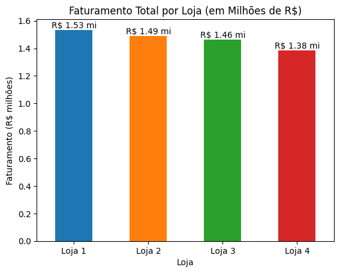
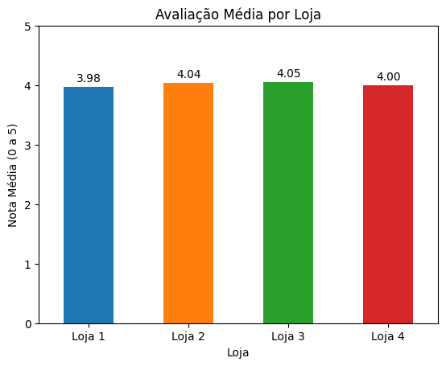
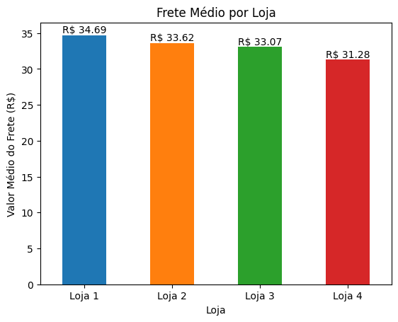
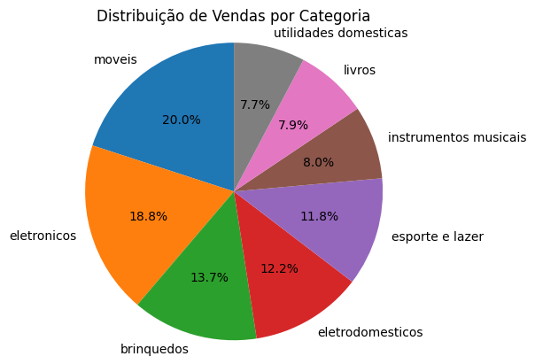
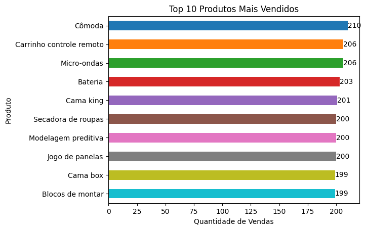
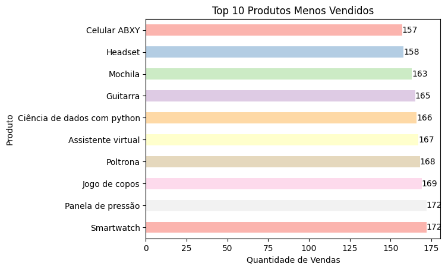
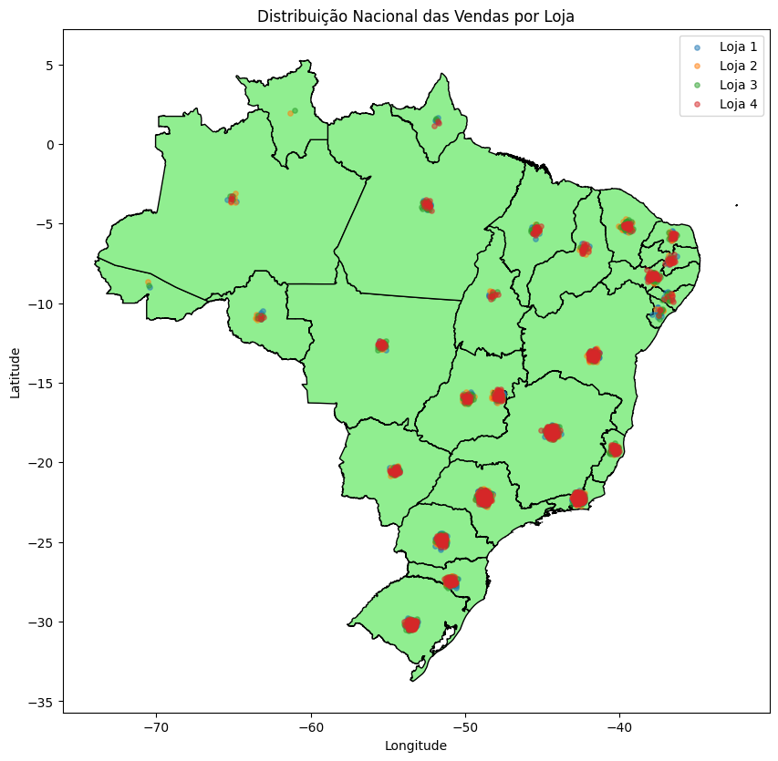

# Challenge_Alura_Store
# 📊 Relatório de Análise — Alura Store Brasil

## 📌 Introdução

Este relatório tem como objetivo analisar os dados de vendas das quatro lojas da rede **Alura Store Brasil**, a fim de auxiliar o Senhor João na decisão estratégica de **qual loja deve ser vendida** para viabilizar um novo empreendimento.

A análise foi conduzida a partir de dados reais de vendas, utilizando a linguagem Python e as bibliotecas **Pandas**, **Matplotlib** e **GeoPandas**, considerando os seguintes aspectos:

- Faturamento total
- Avaliação média dos clientes
- Frete médio
- Vendas por categoria
- Produtos mais e menos vendidos
- Distribuição geográfica das vendas no Brasil

---

## 💰 Análise de Faturamento

O faturamento total de cada loja foi calculado a partir da soma dos valores de venda. Para facilitar a leitura e interpretação, os valores foram apresentados em **milhões de reais**.

### 🔎 Análise
Observa-se que a **Loja 4 apresenta o menor faturamento total**, ficando significativamente abaixo das demais unidades. Esse indicador aponta menor capacidade de geração de receita e sugere um desempenho inferior.

---

## ⭐ Avaliação Média dos Clientes

A avaliação média foi obtida a partir das notas atribuídas pelos clientes após cada compra.

### 🔎 Análise
A **Loja 4 também possui a pior avaliação média**, indicando menor nível de satisfação dos clientes. Esse fator é crítico, pois impacta diretamente a fidelização e o potencial de crescimento da loja.

---

## 🚚 Análise do Frete Médio

Foi analisado o valor médio do frete por loja, um fator importante na experiência do cliente e na decisão de compra.

### 🔎 Análise
A Loja 4 apresenta um **frete médio elevado**, o que pode desencorajar compras e contribuir para seu desempenho inferior quando comparada às demais lojas.

---

## 🛒 Distribuição de Vendas por Categoria

A distribuição das vendas por categoria foi analisada utilizando um **gráfico de pizza**, permitindo observar a proporção de cada categoria no total de vendas.

### 🔎 Análise
As vendas concentram-se majoritariamente em categorias de tecnologia, como **Eletrônicos** e **Informática**, enquanto outras categorias possuem participação menor. A Loja 4 apresenta menor destaque mesmo nas categorias mais relevantes.

---

## 🏆 Produtos Mais Vendidos

Foram identificados os 10 produtos mais vendidos, considerando a quantidade de registros de venda.

### 🔎 Análise
Os produtos mais vendidos pertencem principalmente às categorias de maior demanda. A Loja 4 possui **menor participação nesses produtos de alto giro**, o que impacta diretamente seu faturamento.

---

## 📉 Produtos Menos Vendidos

Também foram analisados os 10 produtos com menor volume de vendas.

### 🔎 Análise
A presença de produtos com baixo giro indica oportunidades de revisão de portfólio. A Loja 4 concentra uma parcela relevante desses produtos, reforçando sua menor eficiência operacional.

---

## 🌎 Distribuição Geográfica das Vendas

Utilizando dados de latitude e longitude, foi elaborado um mapa do Brasil com a distribuição espacial das vendas por loja. Para evitar sobreposição de pontos em regiões com múltiplas vendas, foi aplicado um **jitter geográfico**.

### 🔎 Análise
O mapa evidencia maior concentração de vendas nas regiões **Sudeste e Sul**. Nota-se que a **Loja 4 possui menor capilaridade geográfica**, com distribuição mais limitada em comparação às demais lojas.

---

## ✅ Conclusão e Recomendação Final

Com base nas análises realizadas — faturamento, avaliações dos clientes, frete médio, desempenho por categoria, produtos vendidos e distribuição geográfica — conclui-se que a **Loja 4 apresenta o pior desempenho geral entre as quatro unidades da Alura Store**.

### 📌 Principais pontos que sustentam a decisão:
- Menor faturamento total
- Segunda pior avaliação média dos clientes
- Frete médio elevado
- Menor participação em categorias estratégicas
- Produtos com baixo giro
- Menor dispersão geográfica das vendas

### 🏁 Recomendação
Dessa forma, a **melhor decisão estratégica é a venda da Loja 4**, permitindo ao Senhor João investir em um novo empreendimento, mantendo as lojas com maior rentabilidade, melhor desempenho e maior potencial de crescimento.

---
